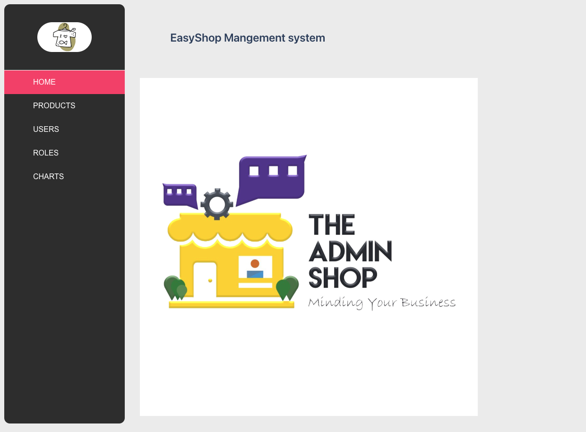
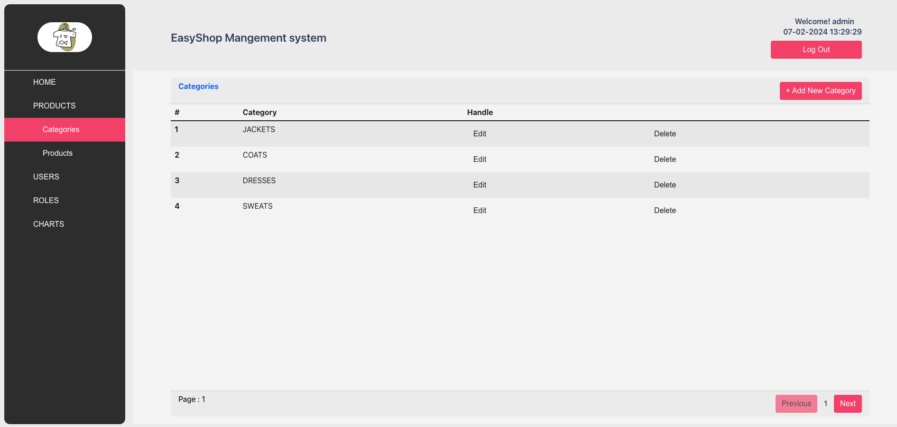
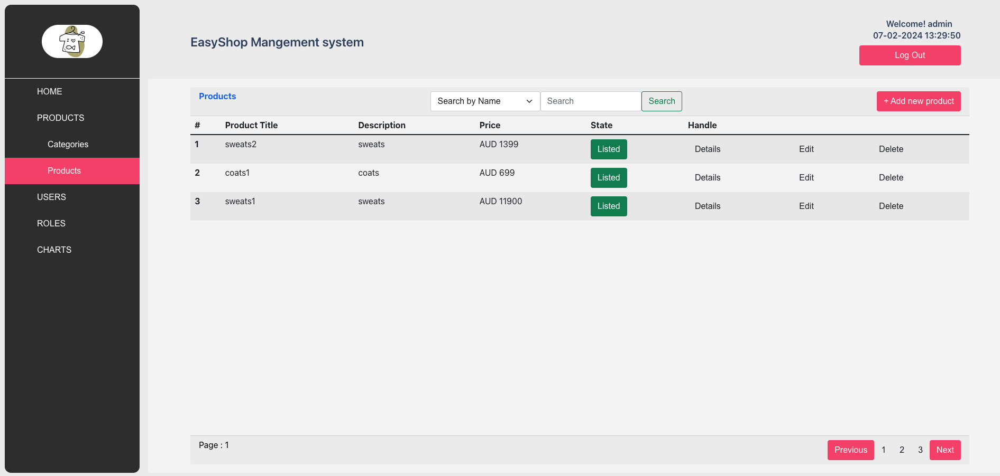
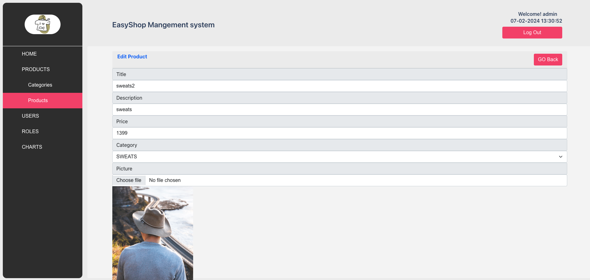
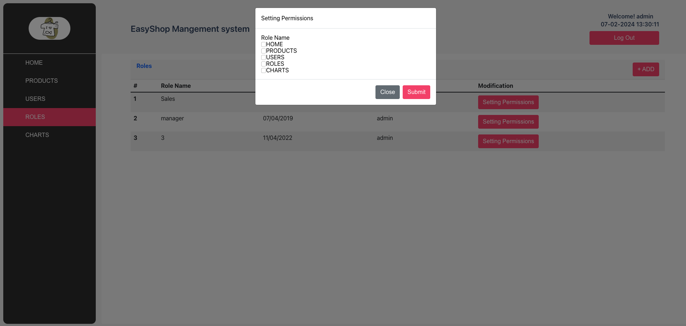
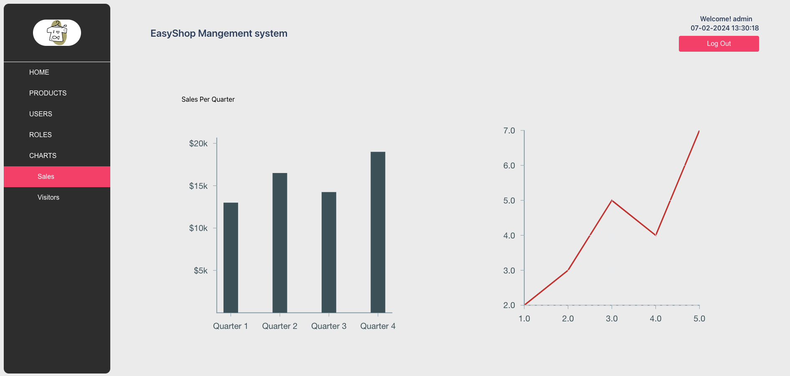
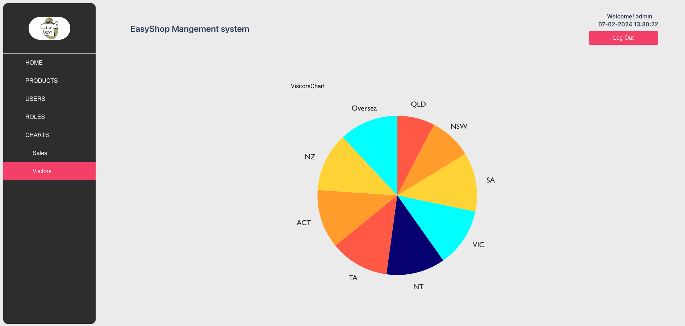

# EasyShop Management System

## Introduction:

EasyShop Management System is a robust application built with React, Redux, and SASS, seamlessly integrating with backend APIs via Axios for comprehensive database operations. This system empowers businesses with essential features such as dynamic product category management, efficient CRUD operations, advanced product search capabilities, inventory status control, user information editing, role-based permissions for system personnel, and insightful sales data visualization through interactive charts.

## Key Features

1. **Dynamic Product Category Management:**

   EasyShop Management System provides intuitive buttons and forms for effortless addition, deletion, and modification of product categories, enabling administrators to maintain an organized and up-to-date product hierarchy.

   

2. **Efficient CRUD Operations with Axios:** 

   The application employs Axios to interact with backend APIs, facilitating seamless Create, Read, Update, and Delete operations for product information, ensuring a smooth flow of data between the frontend and the database.

3. **Advanced Product Search and Inventory Status:** 

   Users benefit from a sophisticated product search functionality, enhancing the efficiency of locating specific items. Additionally, administrators can manage product availability by adjusting the on-shelf status, ensuring accurate inventory control.

   

4. **Products and User Information Editing:** 

   EasyShop Management System allows for the convenient editing of user information, ensuring that administrative tasks related to user accounts can be efficiently handled within the application.

   

   

5. **Role-Based Permissions for System Personnel:** 

   Administrators can set role-based permissions for system personnel, defining specific access levels and capabilities based on their roles. This ensures a secure and controlled environment for managing the e-commerce platform.

   

6. **Insightful Sales Data Visualization:** 

   The system features interactive charts that visualize sales data, providing administrators with valuable insights into product performance, customer preferences, and overall business trends. This data-driven approach facilitates informed decision-making.

   

   

## Available Scripts

In the project directory, you can run:

### `npm start`

Runs the app in the development mode.\
Open [http://localhost:3000](http://localhost:3000) to view it in your browser.

The page will reload when you make changes.\
You may also see any lint errors in the console.

### `npm run build`

Builds the app for production to the `build` folder.\
It correctly bundles React in production mode and optimizes the build for the best performance.

The build is minified and the filenames include the hashes.\
Your app is ready to be deployed!

See the section about [deployment](https://facebook.github.io/create-react-app/docs/deployment) for more information.
